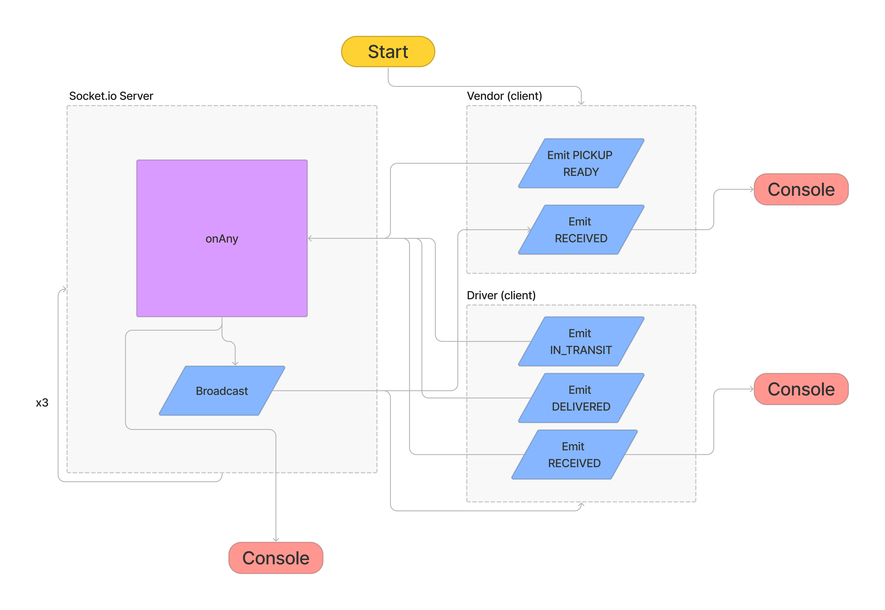
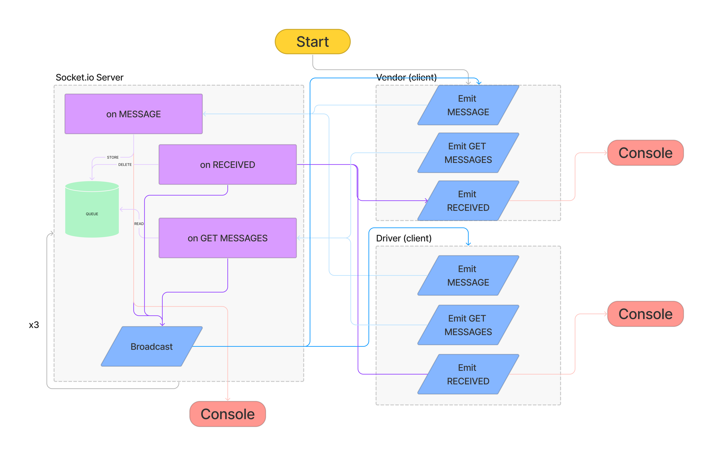

# Lab - Class 11-14

## Project: CAPS

### Author: Julian Barker

### Problem Domain

Build an application for a product called CAPS - The Code Academy Parcel Service. This system will emulate a real world supply chain. CAPS will simulate a delivery service where vendors (such a flower shops) will ship products using our delivery service and when our drivers deliver them, each vendor will be notified that their customers received what they purchased.

#### User Stories

- As a vendor, I want to alert the system when I have a package to be picked up.
- As a driver, I want to be notified when there is a package to be delivered.
- As a driver, I want to alert the system when I have picked up a package and it is in transit.
- As a driver, I want to alert the system when a package has been delivered.
- As a vendor, I want to be notified when my package has been delivered.

- As a developer, I want to use industry standards for managing the state of each package.
- As a developer, I want to create an event driven system so that I can write code that happens in response to events, in real time.

### Links and Resources

- No deployment yet.

### Setup

#### `.env` requirements (where applicable)

- `PORT` - 3001

#### How to initialize/run your application (where applicable)

- `npm i` - install all relevant packages on the local machine
- `npm start` (alias for `node index.js`)

#### Features / Routes

- Allows drivers and vendors to respond to each other's events
- Allows drivers and vendors to catch up on missed messages while they were disconnected

#### Tests

- run tests with `npm test`
- tests are not comprehensive/exhaustive

#### UML

### Attributions
